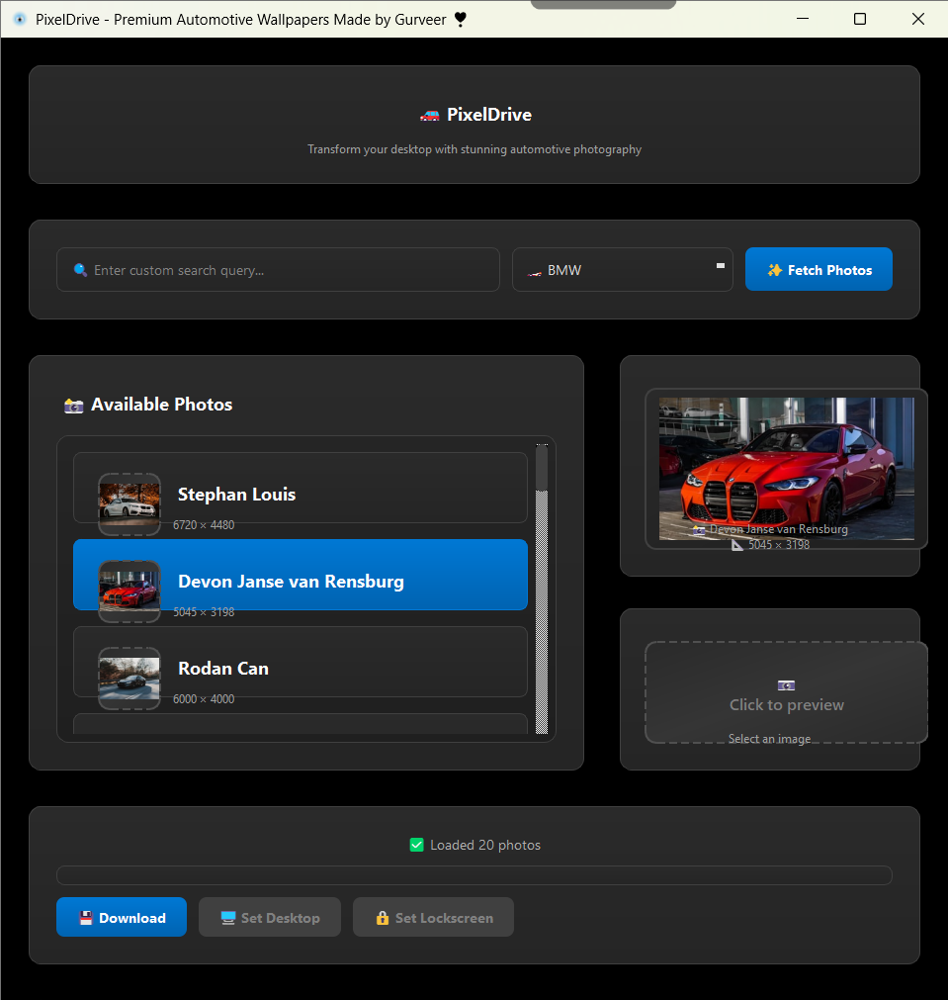

# PixelDrive 🚗

> **Transform your desktop with stunning automotive photography**

PixelDrive is a premium desktop wallpaper manager that brings the world's most beautiful automotive photography directly to your desktop. Featuring curated collections from luxury car brands like McLaren, Ferrari, Tesla, and more, PixelDrive offers a sophisticated user experience with its modern dark theme, smooth animations, and intuitive interface.

## 🖼️ **Application Interface**



*PixelDrive's premium dark theme interface showcasing automotive wallpaper collections with smooth animations and intuitive controls.*

## ✨ Features

### 🚗 **Curated Automotive Collections**
- **Premium Brands**: McLaren, Ferrari, Tesla, Lamborghini, Porsche, and more
- **High-Quality Images**: Full-resolution photography from Unsplash
- **Smart Categories**: Organized by car manufacturers and styles

### 🎨 **Modern User Experience**
- **Premium Dark Theme**: Sophisticated interface with gradients and animations
- **Loading States**: Smooth spinners and progress indicators
- **Interactive Previews**: Rich image cards with photographer metadata
- **Hover Effects**: Polished micro-interactions throughout

### ⚡ **Intelligent Automation**
- **Auto-Startup**: Automatically sets stunning wallpapers on system start
- **Configurable Behavior**: Choose between auto-close or manual browsing mode
- **Smart Downloads**: Async loading with progress tracking

### 🖥️ **Cross-Platform Support**
- **Windows**: Desktop and lockscreen wallpaper support
- **macOS**: Seamless desktop wallpaper integration
- **Linux**: GNOME desktop environment support

## 🚀 Quick Start

### 📦 **Ready-to-Use Executable**
1. Download the latest release
2. Run `PixelDrive.exe` (Windows) or equivalent for your platform
3. Enjoy instant automotive wallpapers!

### 🛠️ **Install from Source**

**Prerequisites:**
- Python 3.7 or higher
- PyQt5
- requests library

**Installation Steps:**
1. Clone this repository:
   ```bash
git clone https://github.com/gurr-i/PixelDrive-pro.git
   cd PixelDrive-pro
```
2. Install dependencies:
   ```bash
pip install -r requirements.txt
```
3. Run PixelDrive:
   ```bash
python -m wallpaper_changer.main
```
4. Run build commands:
   ```bash
python -m PyInstaller wallpaper_changer.spec
```
5. Run the executable:
   ```bash
./dist/Wallpaper\ Changer.exe
```
   ```bash
python -m PyInstaller wallpaper_changer.spec
```
6. Run the executable:
   ```bash
./dist/Wallpaper\ Changer.exe
```

### 📦 **Install as Package**

```bash
pip install -e .
pixeldrive  # New command
# or
wallpaper-changer  # Legacy compatibility
```

## Configuration

### Auto-Close Behavior

Control whether the app automatically closes after setting a wallpaper:

```python
# In wallpaper_changer/config.py
AUTO_CLOSE_AFTER_WALLPAPER = True   # Set to False to keep app open
AUTO_CLOSE_DELAY_MS = 1000          # Delay before closing (milliseconds)
```

**Quick Configuration:**
```bash
# Use the configuration helper
python wallpaper_config.py

# Or run demo without auto-close
python demo_no_autoclose.py
```

### Unsplash API Key

The application uses the Unsplash API to fetch images. You can:

1. Use the default API key (limited requests)
2. Set your own API key as an environment variable:
   ```bash
export UNSPLASH_API_KEY="your_api_key_here"
```

To get your own API key:
1. Go to [Unsplash Developers](https://unsplash.com/developers)
2. Create an account and register a new application
3. Copy your Access Key

### Download Directory

By default, wallpapers are saved to `~/OneDrive/Pictures/Unsplash_Wallpapers`. This can be modified in the configuration.

## Usage

### Automatic Mode
Simply run the application and it will automatically:
1. Fetch a random wallpaper from the available categories
2. Download it
3. Set it as your desktop wallpaper
4. Close the application

### Manual Mode
1. Select a category from the dropdown or enter a custom search term
2. Click "Fetch" to load available images
3. Click on an image to preview it
4. Click "Download" to save the image
5. Click "Set Desktop" or "Set Lockscreen" to apply the wallpaper

## Categories

The application includes predefined categories focused on luxury and sports cars:
- McLaren
- CyberTruck
- Tesla
- Sports Cars
- Ferrari
- Bugatti
- Jeep Wrangler
- BMW
- Supra
- Porsche
- Audi
- Lamborghini
- Koenigsegg
- Pagani
- Aston Martin
- Hennessey

## Platform Support

- **Windows**: Full support for desktop and lockscreen wallpapers
- **macOS**: Desktop wallpaper support (lockscreen uses desktop wallpaper)
- **Linux**: Desktop and lockscreen support (GNOME)

## License

This project is licensed under the MIT License.

## Credits

- Images provided by [Unsplash](https://unsplash.com)
- Built with PyQt5
- Created by Gurveer ❣️

top and lockscreen support (GNOME)

## License

This project is licensed under the MIT License.

## Credits

- Images provided by [Unsplash](https://unsplash.com)
- Built with PyQt5
- Created by Gurveer ❣️

